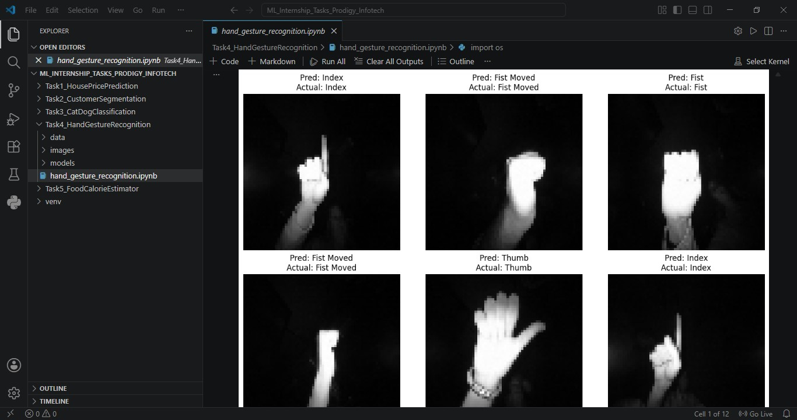
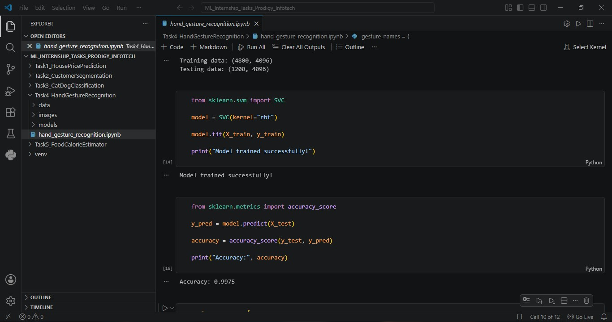

# ✋ Hand Gesture Recognition System

An AI-powered hand gesture recognition system built using Machine Learning and Computer Vision techniques.

The system classifies different hand gestures from image data and predicts the corresponding gesture with high accuracy.

---

## 🚀 Features

- Hand gesture classification
- Image preprocessing
- Machine Learning-based prediction
- Gesture recognition using SVM
- High model accuracy
- Visual prediction results
- Dataset analysis and evaluation

---

## 🛠️ Tech Stack

- Python
- OpenCV
- NumPy
- Matplotlib
- Scikit-Learn
- Jupyter Notebook

---

## 📂 Project Structure

```text
Hand-Gesture-Recognition
│
├── data/
├── images/
├── models/
├── hand_gesture_recognition.ipynb
└── README.md
```

---

## ✋ Recognized Gestures

The model is trained to identify multiple hand gestures such as:

- Palm
- Fist
- Thumb
- Index
- Fist Moved

---

## ⚙️ How It Works

1. Load gesture image dataset.
2. Preprocess and normalize images.
3. Extract image features.
4. Train an SVM classifier.
5. Predict hand gestures from unseen images.
6. Display prediction results and evaluation metrics.

---

## 📊 Model Performance

The trained model achieved:

```text
Accuracy: 99.75%
```

This demonstrates the effectiveness of Machine Learning techniques for gesture recognition tasks.

---

## 📸 Project Preview






---

## 🎯 Learning Outcomes

Through this project, I gained practical experience in:

- Computer Vision
- Image Processing
- Feature Engineering
- Machine Learning Classification
- Support Vector Machines (SVM)
- Dataset Handling
- Model Evaluation

---

## 🔮 Future Improvements

- Real-time webcam gesture recognition
- Deep Learning-based gesture detection
- Larger gesture datasets
- Dynamic gesture recognition
- Human-computer interaction applications
- Deployment as a web application

---

## 👩‍💻 Author

**Madhura Malap**

GitHub: https://github.com/Madhura-Malap
